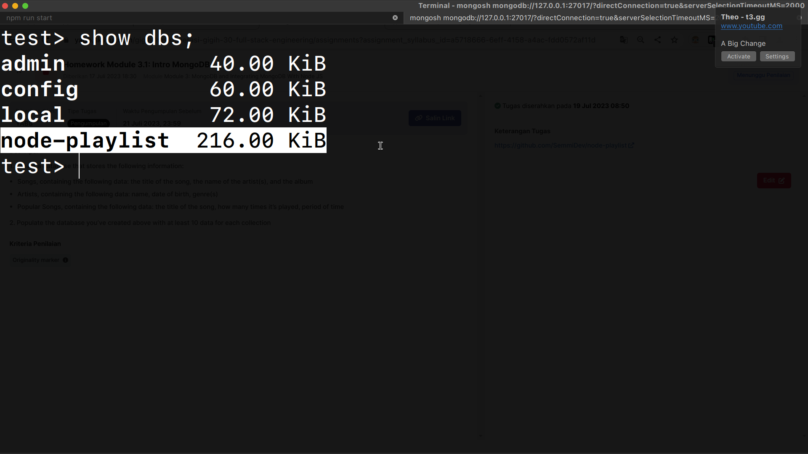
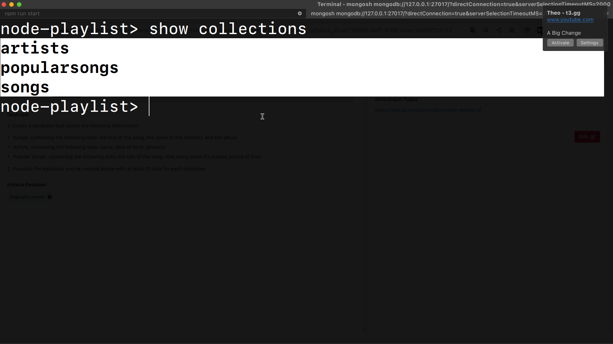
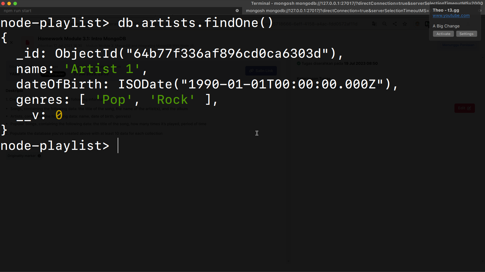
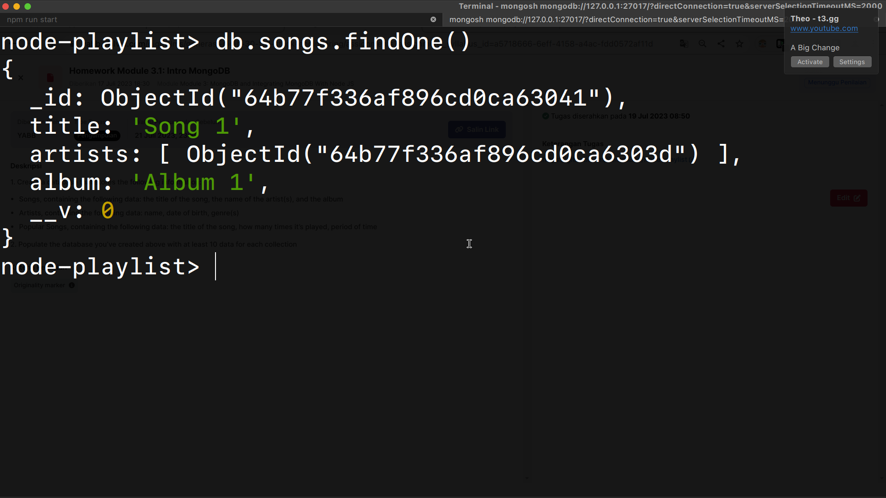
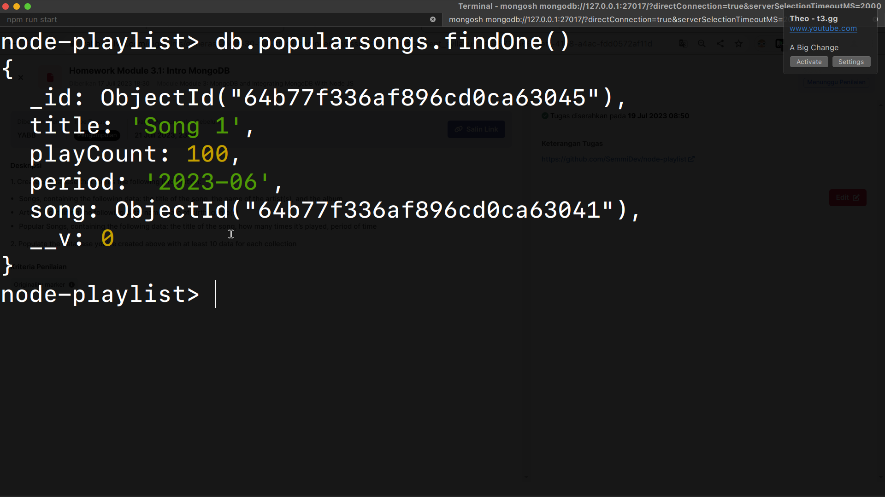
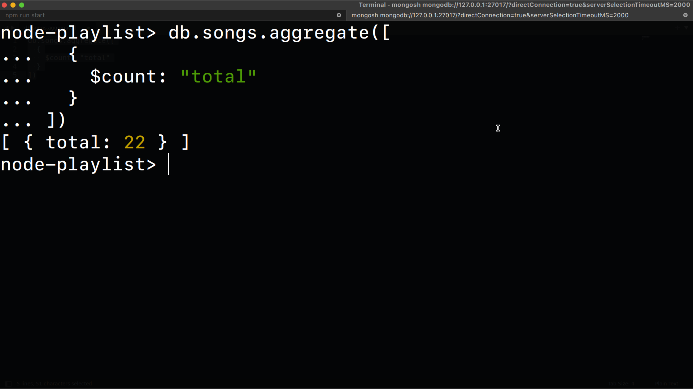
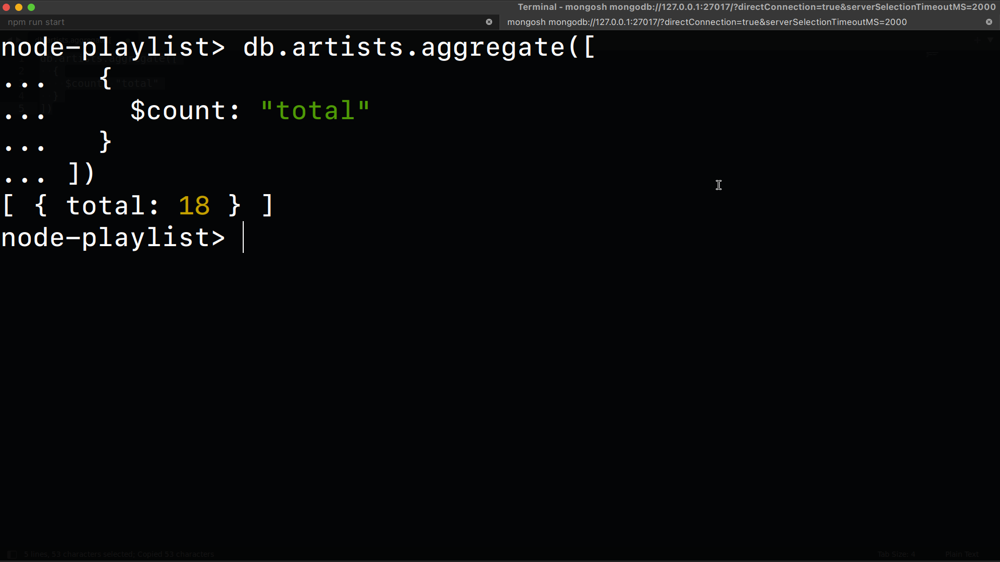
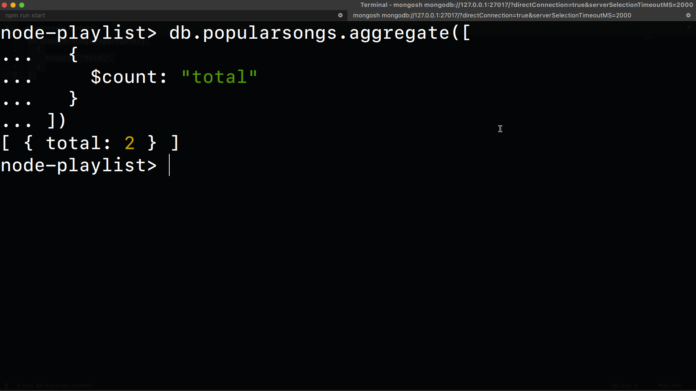

# Module 3.1 MongoDB

## How to run this project?

> I assume you have already installed nodejs & docker/docker-compose locally

```bash
# 1. Run the mongodb server
docker-compose up -d
```

```bash
# 2. Clone or download this repo and cd into it
git@github.com:SemmiDev/node-playlist.git && cd node-playlist
```

```bash
# 3. Install dependencies
npm install
```

```bash
# 4. Run the program
npm run start
```

```bash
# 5.  want to run the api server? make sure install rest client extension on your vscode

see: playground.http file
```

```bash
That's it!
```

## Screenshot

### List databases



### List collections



### Mengambil 1 data dari collection artists



### Mengambil 1 data dari collection songs



### Mengambil 1 data dari collection popularsongs



### Menghitung total data di collection artists



### Menghitung total data di collection songs



### Menghitung total data di collection popularsongs


